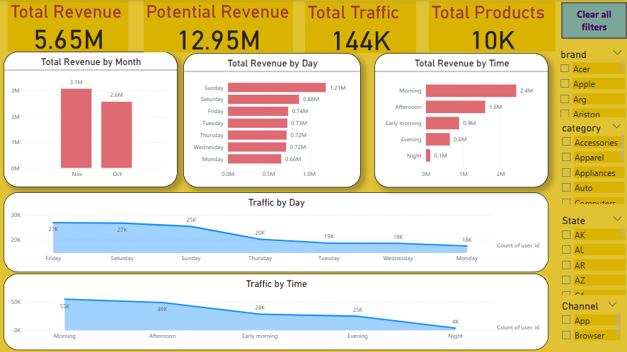
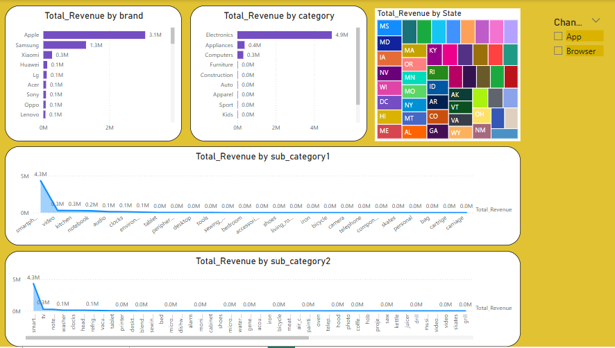

# E-commerce Data Analysis & Spend Prediction (SQL + Power BI + Python)

This end-to-end analytics project demonstrates how raw e-commerce event-level data was transformed using SQL, visualized with Power BI, and extended with a regression model in Python to predict user-level spending behavior.

---

## 🛠 Project Workflow

- **SQL**: Queried and aggregated raw sales data to build insights on traffic, revenue, and product performance.
- **Power BI**: Designed an interactive dashboard with KPIs, time-based trends, and dynamic filters.
- **Python (ML)**: Developed a regression model to predict total spending per user based on session features and behavior.
- **Data Analysis**: Delivered insights on engagement patterns, top brands, peak hours, and user segmentation.

---

## 📊 Dashboard Pages

### **1. E-commerce Overview**
- **KPIs**: Total Revenue, Potential Revenue, Total Traffic, Total Products
- **Visuals**:
  - Revenue by Month (Stacked Column Chart)
  - Revenue by Day (Stacked Bar Chart)
  - Revenue by Hour (Stacked Bar Chart)
  - Traffic by Day (Line Chart)
  - Traffic by Hour (Line Chart)
- **Slicers**: Brand, Category, State, Channel

### **2. Revenue-wise Sub Category**
- Revenue by Brand (Stacked Bar Chart)
- Revenue by Category (Stacked Bar Chart)
- Revenue by Sub-category 1 (Line Chart)
- Revenue by Sub-category 2 (Line Chart)
- Revenue by State (Treemap)
- **Slicer**: Channel

---

## 🔎 SQL Insights Extracted
- Total Revenue, Total Events, and Unique Users
- Day-wise and Hour-wise engagement patterns
- Top Brands and Sub-categories by Revenue
- State-wise revenue breakdown
- Monthly Revenue by Category (Oct & Nov)

---

## 🤖 ML: Spend Prediction Using Linear Regression
- Aggregated user-level features from 144K+ event records (brand interactions, session counts, avg engagement time, etc.)
- Applied One-Hot Encoding, StandardScaler, and trained a Linear Regression model.
- **Model Performance**:  
  - **R² Score**: 0.13  
  - **RMSE**: ₹427  
- Insight: Session-level behavior alone was not a strong predictor of user spending — deeper transactional signals may be required.

---

## 💡 Key Insights
- **Brand Breakdown**: Samsung led in customer count, followed by Apple and Xiaomi.
- **Time Analysis**: Peak engagement occurred in the Afternoon and Evening.
- **Geographic Trends**: GA and KY were the top-performing states by revenue.
- **Product Focus**: Smartphones and Notebooks dominated revenue across both months.

---

## 🧰 Tools Used
- **SQL Server** – Data cleaning, transformation, aggregation
- **Power BI** – Interactive dashboard, KPIs, time trends, filters
- **Python (Pandas, Scikit-learn)** – Regression modeling
- **Excel** – Initial preprocessing
- **DAX** – Custom measures and logic

---

## 📸 Screenshots

